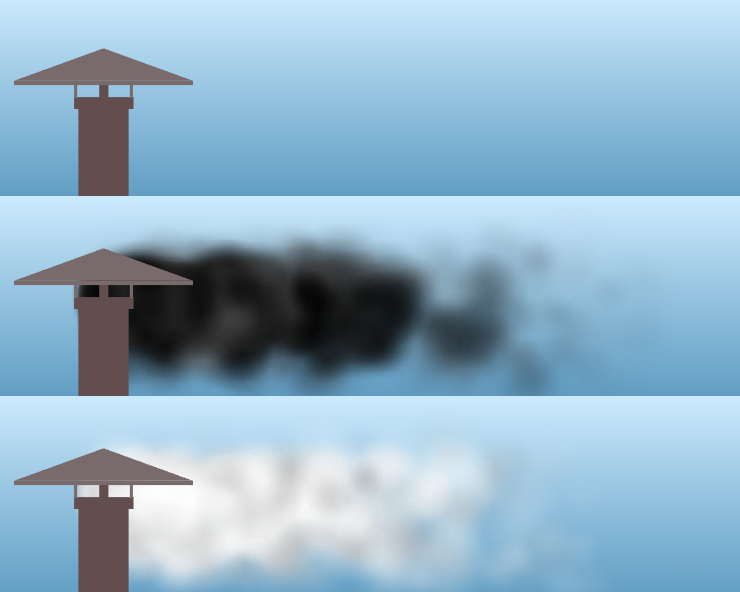

#  smoke

> a DER SPIEGEL widget




## Original use

Landing page [spiegel.de](https://spiegel.de) (not online any more)

[Conclave overview page of DER SPIEGEL](https://www.spiegel.de/thema/konklave)


## Run locally

```
git clone https://github.com/spiegelgraphics/smoke.git
cd smoke
npm install
npm run dev
```


## Built by

the [DER SPIEGEL](https://www.spiegel.de) data & visualizations team, 2025.

The application was slightly changed compared to its original to be able to run it outside of a dedicated CMS.


## License

Apache License Version 2.0